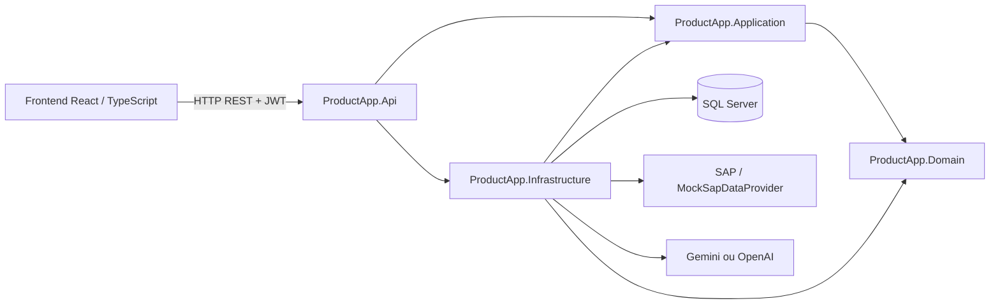

# ProductApp

<p align="center">
  
  
  
  
</p>

<p align="center">
  
  
  
  
</p>

> Plateforme industrielle de suivi de production et d'aide à la décision commerciale, conçue pour exploiter les données de fabrication, les ressources SAP et les indicateurs de marché dans une même solution.

## Sommaire

- Vision et périmètre
- Fonctionnalités
- Architecture
- Technologies
- Prérequis et installation
- Configuration
- Lancement
- Base de données
- API et documentation
- Tests et qualité
- Structure du dépôt
- Sécurité
- Intégration SAP
- Contribution
- État du projet

## Vision et périmètre

ProductApp accompagne le cycle de décision autour d'un produit industriel :

1. définir un produit et ses versions ;
2. modéliser les étapes de production et leurs ressources ;
3. estimer les coûts, la marge et la faisabilité commerciale ;
4. comparer des scénarios et effectuer des simulations what-if ;
5. suivre les ordres et les confirmations de production ;
6. centraliser les études de marché, risques et concurrents ;
7. exploiter les données SAP via un fournisseur abstrait ;
8. tracer les actions et administrer les utilisateurs, rôles et notifications.

Le cas d'usage de référence est une chaîne de production de biscuits, mais le modèle métier reste généralisable à d'autres produits industriels.

## Fonctionnalités

### Gestion industrielle

- catalogue de produits et catégories ;
- versions de produits ;
- étapes de production ordonnables ;
- ressources d'étape, équipements et matières ;
- expériences et scénarios de production ;
- ordres, confirmations et suivi d'avancement ;
- calculs de coût de revient, marge et indicateurs de production.

### Aide à la décision commerciale

- études de marché ;
- analyse des concurrents ;
- gestion des risques ;
- score financier, marché, production et score global ;
- recommandations et demandes d'optimisation ;
- simulations de scénarios.

### Plateforme et administration

- authentification JWT avec access token et refresh token ;
- rôles Administrator, ProductionManager et CommercialManager ;
- autorisations par politiques et permissions ;
- audit des opérations ;
- notifications applicatives ;
- documentation OpenAPI/Swagger en développement ;
- assistant Smart Product avec Gemini par défaut et repli OpenAI configurable.

## Architecture

Le backend suit une Clean Architecture avec une organisation fonctionnelle par module :



Règles de dépendance :

- Domain ne dépend d'aucune couche technique ;
- Application dépend uniquement de Domain ;
- Infrastructure implémente la persistance, l'identité, SAP, les notifications et les services externes ;
- Api expose les cas d'utilisation au travers d'API REST ;
- le frontend ne communique qu'avec l'API.

Les cas d'utilisation applicatifs utilisent des commandes, requêtes, handlers, DTO et validateurs. Les contrôleurs ne renvoient pas directement les entités de persistance.

## Technologies

| Domaine | Technologie |
|---|---|
| Backend | C# / ASP.NET Core / .NET 10 |
| Architecture applicative | Clean Architecture, CQRS, MediatR |
| Validation | FluentValidation |
| Persistance | Entity Framework Core / SQL Server |
| Authentification | ASP.NET Identity / JWT Bearer |
| Observabilité | Serilog, health check, Problem Details |
| API | REST, Swagger / OpenAPI |
| Frontend | React 19, TypeScript, Vite |
| UI | Tailwind CSS, Lucide, React Hook Form, Zod |
| Données et graphiques | TanStack Query, TanStack Table, Recharts |
| Tests backend | xUnit et outils de test .NET |
| Tests frontend | Vitest, Testing Library, jsdom |

## Prérequis

- Windows avec PowerShell ou invite de commandes ;
- .NET SDK 10 ;
- Node.js et npm ;
- SQL Server local ou accessible ;
- Git ;
- accès réseau uniquement si l'IA, l'e-mail ou SAP réel sont activés.

Vérification :

```powershell
dotnet --version
node --version
npm --version
```

## Installation

Depuis la racine :

```powershell
git clone <url-du-depot>
cd productapp
dotnet restore backend\ProductApp.sln
npm install --prefix frontend
```

Le script start-productapp.cmd automatise l'installation initiale du frontend et lance l'API ainsi que Vite.

## Configuration

### Backend

La configuration principale se trouve dans backend/src/ProductApp.Api/appsettings.json. Pour le développement, utiliser appsettings.Development.json, les variables d'environnement ou backend/.env.

Un exemple est fourni dans backend/.env.example. Ne jamais versionner de secret.

| Paramètre | Rôle | Valeur locale |
|---|---|---|
| ConnectionStrings:DefaultConnection | Connexion SQL Server | Server=localhost;Database=ProductApp;Trusted_Connection=True;TrustServerCertificate=True |
| Jwt__SigningKey | Signature JWT, 32 caractères minimum | clé aléatoire locale |
| Cors__AllowedOrigins__0 | Origine frontend | http://localhost:5173 |
| SapIntegration__Provider | Fournisseur SAP | Mock |
| SmartProduct__Provider | Fournisseur IA | Gemini ou OpenAI |
| GEMINI_API_KEY | Clé Gemini | secret local uniquement |
| OPENAI_API_KEY | Clé OpenAI facultative | secret local uniquement |

Pour lancer manuellement :

```powershell
$env:Jwt__SigningKey = "cle-locale-de-developpement-d-au-moins-32-caracteres"
```

Le projet charge automatiquement le fichier .env présent dans backend lorsqu'il existe.

### Frontend

Copier frontend/.env.example vers frontend/.env :

```env
VITE_API_BASE_URL=http://localhost:5220/api
VITE_USE_MOCKS=false
```

Les variables Vite sont publiques côté navigateur : aucune clé secrète ne doit y être placée.

## Lancement

### Démarrage recommandé sous Windows

```powershell
.\start-productapp.cmd
```

Adresses locales :

- frontend : http://localhost:5173 ;
- API HTTP : http://localhost:5220 ;
- API HTTPS : https://localhost:7091 ;
- health check : http://localhost:5220/api/health ;
- Swagger : http://localhost:5220/swagger en environnement Development.

### Démarrage manuel

Backend :

```powershell
$env:Jwt__SigningKey = "cle-locale-de-developpement-d-au-moins-32-caracteres"
dotnet run --project backend/src/ProductApp.Api/ProductApp.Api.csproj --launch-profile http
```

Frontend :

```powershell
npm run dev --prefix frontend -- --open
```

## Base de données

ProductApp utilise SQL Server avec Entity Framework Core. Les migrations sont stockées dans :

```
backend/src/ProductApp.Infrastructure/Persistence/Migrations
```

Appliquer les migrations :

```powershell
dotnet tool restore --tool-manifest backend/.config/dotnet-tools.json
dotnet ef database update --project backend/src/ProductApp.Infrastructure --startup-project backend/src/ProductApp.Api
```

Créer une migration après une évolution du modèle :

```powershell
dotnet ef migrations add NomDeLaMigration --project backend/src/ProductApp.Infrastructure --startup-project backend/src/ProductApp.Api
```

La connexion de conception est définie par ApplicationDbContextFactory. Avant toute opération destructive, vérifier la chaîne de connexion et l'environnement ciblé.

## API et documentation

Les contrôleurs couvrent notamment :

- authentification et administration ;
- produits, versions et étapes de production ;
- ressources, expériences et production ;
- analyses de marché, concurrents, risques et optimisation ;
- intégration SAP ;
- notifications et audit ;
- conversations et outils Smart Product.

Swagger est disponible en développement à l'adresse :

```
http://localhost:5220/swagger
```

Swagger utilise l'authentification Bearer JWT. L'endpoint de santé est public.

## Tests et qualité

Vérification complète recommandée :

```powershell
dotnet restore backend/ProductApp.sln
dotnet build backend/ProductApp.sln
dotnet test backend/ProductApp.sln
npm run build --prefix frontend
npm run test --prefix frontend
npm run lint --prefix frontend
```

Projets de tests backend :

```
backend/tests/ProductApp.Domain.Tests
backend/tests/ProductApp.Application.Tests
backend/tests/ProductApp.Infrastructure.Tests
backend/tests/ProductApp.Api.Tests
```

Les tests doivent couvrir en priorité les calculateurs de coût, marge et faisabilité, les validateurs, les handlers, les endpoints sensibles et le fournisseur SAP simulé.

## Structure du dépôt

```
productapp/
├── backend/
│   ├── src/
│   │   ├── ProductApp.Domain/          # Règles métier et entités pures
│   │   ├── ProductApp.Application/     # Cas d'utilisation, DTO, interfaces
│   │   ├── ProductApp.Infrastructure/  # EF Core, SQL Server, SAP, identité
│   │   └── ProductApp.Api/             # REST, auth, Swagger, middleware
│   ├── tests/
│   │   ├── ProductApp.Domain.Tests/
│   │   ├── ProductApp.Application.Tests/
│   │   ├── ProductApp.Infrastructure.Tests/
│   │   └── ProductApp.Api.Tests/
│   ├── ProductApp.sln
│   ├── .env.example
│   └── .config/dotnet-tools.json
├── frontend/
│   ├── src/                            # Pages, composants, API, types
│   ├── public/
│   ├── .env.example
│   └── package.json
├── AGENTS.md
├── AUDIT_TECHNIQUE.md
├── SMART_PRODUCT_AI.md
└── start-productapp.cmd
```

## Sécurité

- générer une clé JWT d'au moins 32 caractères hors du code source ;
- ne jamais stocker de mot de passe en clair ;
- ne jamais mettre de clé SAP, SMTP, Gemini ou OpenAI dans Git ;
- limiter Cors:AllowedOrigins aux origines nécessaires ;
- conserver le fournisseur SAP Mock tant que les informations réelles ne sont pas validées ;
- ne pas exposer les secrets dans les logs ;
- utiliser HTTPS hors développement ;
- vérifier les rôles et permissions sur chaque endpoint sensible ;
- protéger les fichiers d'upload et limiter leur taille ;
- renouveler les secrets compromis et invalider les tokens concernés.

L'API applique également des en-têtes de sécurité, une gestion centralisée des exceptions et des limites de débit sur l'authentification et Smart Product.

## Intégration SAP

L'intégration est abstraite par ISapDataProvider dans Application. Le développement local s'appuie sur MockSapDataProvider.

```
Application : ISapDataProvider
      ↓
Infrastructure : MockSapDataProvider ou connecteur SAP réel
      ↓
API : SapIntegrationController
```

La connexion SAP réelle doit être ajoutée uniquement après validation du protocole, des URLs OData ou du connecteur retenu, des certificats, des comptes techniques et de la politique réseau. Les contrôleurs ne doivent jamais contenir de logique SAP.

## Contribution

Avant toute modification significative :

1. lire AGENTS.md et les documents techniques associés ;
2. analyser la structure et les dépendances existantes ;
3. limiter le périmètre aux fichiers nécessaires ;
4. respecter la séparation Domain / Application / Infrastructure / API ;
5. ajouter ou mettre à jour les tests concernés ;
6. exécuter build backend, tests backend et build frontend ;
7. documenter toute configuration ou décision importante.

Conventions recommandées :

- une fonctionnalité métier par module ;
- async/await et CancellationToken pour les E/S ;
- DTO aux frontières de l'API ;
- validation FluentValidation ;
- logs utiles sans données sensibles ;
- commits courts et explicites ;
- aucune dépendance technique dans le domaine.

## État du projet

Le dépôt contient une base fonctionnelle couvrant le catalogue produit, la production, l'analyse commerciale, l'administration, l'audit, l'intégration SAP simulée et Smart Product.

Les éléments dépendant d'un environnement externe — SAP réel, SMTP réel, clés IA et déploiement de production — doivent être configurés et validés séparément.

Pour les décisions techniques et points de vigilance, consulter :

- AGENTS.md ;
- AUDIT_TECHNIQUE.md ;
- SMART_PRODUCT_AI.md.

## Licence et usage

Projet interne de démonstration et de développement industriel. La licence et les règles de redistribution doivent être précisées avant toute publication externe.

